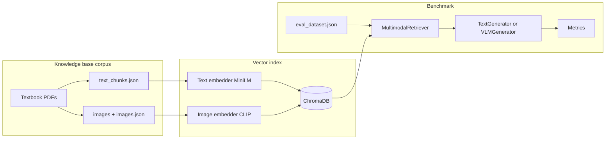

# Multimodal RAG for STEM Diagrams — In-Depth Explanation

This document explains what the project does, how the pieces fit together, and how data flows from raw sources through retrieval and generation to benchmark numbers. It is meant to complement [README.md](README.md) and [docs/GUIDE.md](docs/GUIDE.md) with architectural and conceptual detail.

---

## 1. Motivation and research question

**Goal.** Build a reproducible pipeline to study **physics-oriented visual question answering** when the model can **retrieve** open textbook material (text and figures) and **reason** with either a text-only LLM or a vision-language model (VLM).

**Core comparison.** The project compares:

- **Text-only RAG** (retrieve text chunks only; **B1** uses a text-only LLM on that context; **B2** uses a VLM with the **eval question’s diagram** plus the same text context — retrieved textbook **figures** are **not** added in B2 because retrieval is text-only).
- **Multimodal RAG** (retrieve text chunks *and* textbook figures using aligned text + image embeddings; pass query diagram plus retrieved context into LLaVA).
- **Fine-tuned VLMs** (QLoRA adapters on domain data) with and without retrieval.

The experimental matrix (B1–M3) makes those comparisons explicit (see [Section 8](#8-experimental-configurations-b1m3)).

---

## 2. Conceptual architecture

At a high level:

1. **Corpus (knowledge base):** Textbook PDFs are parsed into **text chunks** and **extracted images**, embedded, and stored in **ChromaDB**.
2. **Evaluation data:** Public datasets (ScienceQA filtered for physics, AI2D) are downloaded, normalized, and merged into a single **`eval_dataset.json`**. Optional **synthetic** Q/A can augment training or evaluation.
3. **Query-time:** For each eval sample, the system **retrieves** top-*k* relevant chunks (and optionally images), **assembles** prompts and image inputs, and **generates** an answer.
4. **Scoring:** Predictions are scored against references with lexical, embedding-based, and optional LLM-judge metrics.

---

## 3. Data: three different roles

Confusing **evaluation data** with the **knowledge base** is a common mistake. This project uses three layers:

| Layer | Purpose | Typical location |
|--------|---------|------------------|
| **Raw acquisition** | Downloads, PDFs, saved images | `data/raw/` |
| **Processed** | Parsed chunks, finetune JSON splits | `data/processed/` |
| **Evaluation** | Unified test/benchmark file | `data/eval/eval_dataset.json` |

- **Knowledge base** = what you **retrieve from** (OpenStax / textbook content indexed in Chroma).
- **Eval set** = what you **answer questions about** (ScienceQA + AI2D items with `question`, `answer`, `image_path`).

They are intentionally separate: the model is not “cheating” by retrieving the exact eval item; it retrieves **textbook** material that may or may not help on a given diagram question.

---

## 4. Building the knowledge base

### 4.1 PDF parsing

Module: `src/ingestion/pdf_parser.py`.

- **Input:** `*.pdf` under `data/raw/textbooks/` (e.g. OpenStax University Physics).
- **Text:** Each page’s plain text is collected, then split into **overlapping chunks by word count** (`CHUNK_SIZE` and `CHUNK_OVERLAP` in `configs/default.py`; the config comments refer to “tokens” but the implementation uses **words** per chunk).
- **Figures:** Embedded images per page are extracted if large enough (tiny icons are skipped). Paths are written as **project-relative** strings for portability.
- **Outputs** per PDF stem under `data/processed/<stem>/`:
  - `text_chunks.json` — entries with `chunk_id`, `page`, `text`, word indices.
  - `images.json` — `page`, `image_path`, `xref`.
  - `metadata.json` — counts and source PDF path.

### 4.2 Embedding and storage

Module: `src/ingestion/build_knowledge_base.py`.

1. Runs parsing for all textbooks (if not already done).
2. Loads **all** `text_chunks.json` files under `data/processed/`, tags each chunk with a `source` (parent folder name).
3. Embeds chunk texts with **`Text embedder`** ([Section 5](#5-embeddings)).
4. Upserts into Chroma collection **`TEXT_COLLECTION`** (default name: `physics_text`): document = chunk text, id = `chunk_id`, metadata = `page`, `source`.
5. Loads **all** `images.json`, resolves paths, skips missing files.
6. Embeds images with **`Image embedder`** (CLIP).
7. Upserts into **`IMAGE_COLLECTION`** (`physics_images`): embedding + metadata (`page`, `source`, `image_path`). Image vectors have synthetic ids `img_0`, `img_1`, …

Persistence: `data/chroma_db/` (SQLite + HNSW index files).

---

## 5. Embeddings

Defined in `configs/default.py` and implemented under `src/embeddings/`.

- **Text:** `sentence-transformers/all-MiniLM-L6-v2` — dense sentence embeddings for chunk and query text.
- **Images (and CLIP text):** `openai/clip-vit-base-patch32` (via OpenCLIP stack in `image_embedder`) — shared space for **image–image** and **text–image** similarity.

Chroma is configured for **cosine** distance; scores are turned into similarities where needed (e.g. `1 - distance`).

---

## 6. Retrieval

Module: `src/retrieval/multimodal_retriever.py`, backed by `src/retrieval/vector_store.py`.

### 6.1 Text-only retrieval

- Embed the question with the text embedder.
- Query the text collection for top-*k* chunks.
- Return formatted hits: id, text, metadata, distance/score.

### 6.2 Multimodal retrieval

Multimodal retrieval still returns **two** lists: **text hits** and **image hits**. The subtle part is how **text** is re-ranked when a **query image** exists.

1. **Text query:** Same as above, but initially `top_k * 2` candidates may be fetched for fusion headroom (implementation detail).
2. **Image query branch:**
   - If the eval sample has an **image file**, embed it with CLIP and query the **image** collection for top-*k* textbook figures.
   - If there is **no** query image, the model uses **CLIP’s text tower** on the question string to query the image collection (so image retrieval can still run in text-only-image mode).
3. **Fusion (when both query image and both result types exist):**  
   **Text chunks are re-ranked** using **page alignment** with retrieved images:
   - For each page that appears in image hits, keep the **maximum** image similarity score for that page.
   - Each text chunk gets  
     `fused_score = alpha * text_score + (1 - alpha) * image_score_on_same_page`  
     where `alpha` is `FUSION_ALPHA` (default `0.5`).  
   - Text results are sorted by `fused_score` and truncated to `top_k`.

So “late fusion” here is **not** simply averaging two global ranked lists; it **boosts text passages that live on the same textbook pages** as visually similar figures.

Returned **image_results** are still the top-*k* textbook images from CLIP, independent of that re-ranking.

### 6.3 What the generator actually sees

The **benchmark runner** and **`RAGPipeline`** align on the same policy:

- If the eval question has a **diagram**, that path is placed **first** in the list of images passed to the VLM.
- Up to **two** additional paths come from **retrieved** textbook images — **only when** the config uses **multimodal** retrieval (M1, M2). For **B2**, retrieval is text-only, so those slots stay empty and the VLM sees **only the query diagram** (if present), not textbook figures from the vector store.

Text-only **B1** uses only retrieved **text** chunks in the Mistral prompt; VLMs use both context strings and the image list as implemented in `vlm_generator`.

---

## 7. Generation

### 7.1 Text generator (B1)

Module: `src/generation/text_generator.py` (not excerpted here). Uses **Mistral-7B-Instruct** (4-bit in the intended setup) to answer from **retrieved text context** only — **no images** are passed to Mistral (`generate(question, context_chunks)`), even if the eval sample has a diagram.

### 7.2 VLM generator (B2, M1, M2, M3)

Module: `src/generation/vlm_generator.py`.

- Base model: **LLaVA-1.5-7B** (`llava-hf/llava-1.5-7b-hf` in config).
- Optional **LoRA adapter** path for fine-tuned configs (M2, M3).
- Accepts **question + text context chunks + list of image paths** so the model conditions on both language and vision.

### 7.3 Unified orchestration

`src/generation/rag_pipeline.py` exposes a **`RAGPipeline`** class with the same config keys as the benchmark (B1–M3) for programmatic use (single `query()` API).

---

## 8. Experimental configurations (B1–M3)

| ID | Retrieval | Generator | Fine-tuned adapter | Intent |
|----|-----------|-----------|--------------------|------------|
| **B1** | Text only | Mistral (text LLM) | No | Strong **text-only RAG** baseline. |
| **B2** | Text only | LLaVA | No | Same retrieval as B1; **VLM** sees the **eval diagram only** (no retrieved textbook figures). |
| **M1** | Multimodal (text + image index, fused text ranking) | LLaVA | No | Full **multimodal RAG** without adapter. |
| **M2** | Multimodal | LLaVA | Yes (`adapter_path`) | Multimodal RAG + **QLoRA**. |
| **M3** | None | LLaVA | Yes | **No retrieval**; tests how much fine-tuning alone explains gains. |

Exact flag logic lives in `src/evaluation/run_benchmark.py` and mirrors `RAGPipeline`.

---

## 9. Evaluation data pipeline

Module: `src/ingestion/download_datasets.py`.

- **ScienceQA** (`derek-thomas/ScienceQA`): keeps items with an image whose question/hint matches a **physics keyword set** (forces, circuits, optics, etc.). Saves images and `physics_samples.json`.
- **AI2D** (`lmms-lab/ai2d`): test split, multiple-choice style fields mapped to `question` / `choices` / `answer`.
- **`build_eval_set()`** merges available sources into **`data/eval/eval_dataset.json`** with a common schema: `id`, `image_path`, `question`, `answer`, `reasoning` (when available), `topic`, `difficulty`, `source`.

**Synthetic data** (optional): `src/ingestion/synthetic_generator.py` can call OpenAI to build diagram-grounded Q/A; outputs such as `data/eval/synthetic_physics_qa.json` can feed **fine-tuning** via `prepare_data.py`, not necessarily the main unified eval file unless you merge them manually.

---

## 10. Fine-tuning

Modules: `src/fine_tuning/prepare_data.py`, `src/fine_tuning/train_qlora.py`, `notebooks/finetune_llava.ipynb`.

- **prepare_data:** Converts ScienceQA (physics) + optional synthetic samples into **LLaVA chat JSON**: `<image>`, human question, assistant answer (with optional reasoning + final answer line).
- **Splits:** Train / val / test JSON under `data/processed/finetune/` (default ratios in code).
- **train_qlora:** QLoRA (4-bit base, LoRA on selected projection layers, gradient checkpointing) with hyperparameters centralized in `configs/default.py` (`LORA_R`, `LORA_ALPHA`, learning rate, batching, etc.).

After training, **adapter weights** are pointed to by `adapter_path` when running **M2** or **M3** benchmarks.

---

## 11. How benchmarking works

Module: `src/evaluation/run_benchmark.py`.

1. Load `eval_dataset.json` (or a path you pass).
2. For each sample: read `question`, `answer` (reference), `image_path`.
3. Instantiate **`MultimodalRetriever`** unless the config uses no retrieval.
4. Retrieve per config rules ([Section 6](#6-retrieval)).
5. Call **TextGenerator** or **VLMGenerator.generate** with context and images.
6. Collect predictions and call **`compute_all_metrics`** in ` src/evaluation/metrics.py`.

### 11.1 Metrics

- **Exact match:** Normalized string equality (lowercase, punctuation stripped).
- **Contains accuracy:** Normalized reference is a **substring** of the prediction (for lenient matching of MC answers inside longer explanations).
- **ROUGE-L:** `rouge_score` package, summary-level F1 averaged over pairs.
- **BERTScore:** semantic similarity (English).
- **GPT-4o judge (optional):** Up to 50 samples scored 1–5 for **correctness** and **reasoning**; requires `OPENAI_API_KEY`. If the key is missing, judge scores are stubbed / noted in the result.

### 11.2 Ablations

`run_ablations()` sweeps **top_k** ∈ {3, 5, 10}, **alpha** ∈ {0.3, 0.5, 0.7} on **M1**, and optional **chain-of-thought** prompting (“Let’s think step by step.” appended to the question).

---

## 12. Configuration and portability

`configs/default.py` centralizes paths, model IDs, retrieval hyperparameters, and LoRA settings.

**Path portability:** Many JSON files store paths relative to the project root (`path_for_storage`). **`ML_PROJECT_ROOT`** (or default repo root) plus **`resolve_data_path`** remap stored strings when you move the repo or run on Kaggle — important for images referenced in eval data and Chroma metadata.

---

## 13. Source tree (conceptual map)

| Area | Path | Role |
|------|------|------|
| Ingestion | `src/ingestion/` | Downloads, PDF parse, KB build, synthetic Q/A, path normalization |
| Embeddings | `src/embeddings/` | Text and image embedding wrappers |
| Retrieval | `src/retrieval/` | Chroma wrapper, multimodal fusion |
| Generation | `src/generation/` | Text LLM, VLM, end-to-end RAG class |
| Evaluation | `src/evaluation/` | Metrics, benchmark CLI, plotting helpers |
| Fine-tuning | `src/fine_tuning/` | LLaVA dataset prep, QLoRA script |
| Config | `configs/default.py` | Single source of truth for hyperparameters |
| Docs | `docs/GUIDE.md` | Step-by-step human runbook |

---

## 14. Summary

This project is a **end-to-end multimodal RAG benchmark framework** for **physics-heavy diagram QA**. It builds a **dual-index knowledge base** (text + figures) from textbooks, retrieves with **MiniLM + CLIP** and **page-aware fusion**, generates with **Mistral or LLaVA** (optionally **QLoRA**), and scores outputs with **lexical, semantic, and optional LLM judge** metrics — all organized around a small, clear **B1–M3** experimental grid for ablations and paper-ready comparisons.
